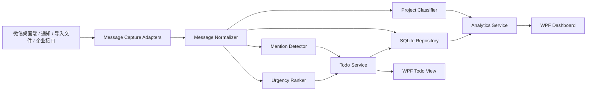

# 微信消息监控桌面软件设计文档

## 1. 背景与目标

用户微信群数量多，项目消息分散，容易漏掉群内 `@我`、紧急事项和跨项目待办。本系统面向 Windows 桌面环境，使用 WPF 技术栈构建一个本地消息监控与分析工具，将微信消息采集、待办提取、项目分类、紧急度排序和多维统计看板整合在一个桌面应用中。

核心目标：

1. 监控用户授权范围内的微信消息，优先发现群聊中 `@我` 的消息。
2. 将所有 `@我` 消息自动加入 Todo 清单的“待办理”状态。
3. 将非 `@我` 消息按项目、类别和规则进行归类。
4. 对消息和待办按紧急程度排序，帮助用户先处理高优先级事项。
5. 提供按项目、时间、类别、状态、紧急程度等维度的统计看板。
6. 数据默认保存在本机 SQLite 数据库中，避免默认上传敏感聊天内容。

范围说明：

1. 本文中的“所有微信消息”指当前用户授权、且能通过合规采集适配器获取到的消息集合。
2. 本文中的“所有 `@我` 消息”指已采集消息中命中 `@我` 识别规则的全部消息。
3. 系统不承诺突破微信个人版未公开接口或安全机制来读取不可访问的全量历史消息。

## 2. 合规边界与设计原则

微信个人版没有公开的全量消息读取接口，因此系统必须将消息采集设计为可插拔适配器，并明确禁止依赖破解、绕过加密、进程注入、盗取密钥等方式。

设计边界：

1. 系统只处理当前用户在本机、本人账号、明确授权范围内的消息。
2. 默认采用桌面端 UI 自动化、通知监听、用户主动导入、企业合规接口等方式采集消息。
3. 不设计微信账号密码采集，不保存微信登录凭据。
4. 不绕过微信安全机制，不提供数据库解密、Hook、注入或逆向方案。
5. 涉及群聊和个人消息的内容默认只保存在本地；如后续接入 AI 云服务，必须提供显式开关、脱敏策略和风险提示。

产品能力分级：

| 等级 | 能力 | 说明 |
| --- | --- | --- |
| MVP | 监控已打开会话、系统通知、用户主动导入的消息 | 最容易合规落地，可先覆盖高频群和重点项目 |
| 标准版 | 扩展聊天窗口轮询、规则配置、消息补偿扫描 | 提升覆盖率，但仍以用户桌面可见内容为边界 |
| 企业版 | 对接企业微信、机器人、组织批准的数据接口 | 适合公司内部项目消息治理 |

## 3. 总体架构

系统采用 WPF + MVVM + 本地 SQLite 的桌面应用架构，分为表现层、应用服务层、领域层和基础设施层。



分层说明：

| 层级 | 职责 | 典型模块 |
| --- | --- | --- |
| Presentation | WPF 页面、控件、ViewModel、用户交互 | TodoView、MessageFeedView、DashboardView、SettingsView |
| Application | 编排业务流程和后台任务 | MessagePipelineService、TodoService、AnalyticsService |
| Domain | 业务模型与规则 | Message、TodoItem、Project、UrgencyScore、ClassificationResult |
| Infrastructure | SQLite、采集适配器、配置、日志、通知 | SqliteRepository、WeChatUiaAdapter、NotificationAdapter |

推荐技术栈：

| 类别 | 方案 |
| --- | --- |
| UI | WPF、MVVM、CommunityToolkit.Mvvm |
| 后台任务 | .NET Generic Host、BackgroundService、Channel 队列 |
| 数据库 | SQLite、Microsoft.Data.Sqlite、EF Core SQLite 或 Dapper |
| 图表 | LiveCharts2、OxyPlot 或同类 WPF 图表库 |
| 日志 | Serilog，本地滚动日志文件 |
| 配置 | appsettings.json + 用户配置表 |
| 隐私保护 | Windows DPAPI 加密敏感配置；可选 SQLCipher 保护本地数据库 |

## 4. 核心功能设计

### 4.1 消息采集

消息采集层使用 Adapter 模式，避免把系统绑定到单一采集方式。

接口设计：

```csharp
public interface IMessageCaptureAdapter
{
    string Name { get; }
    Task<IReadOnlyList<CapturedMessage>> CaptureAsync(CaptureContext context, CancellationToken cancellationToken);
}
```

适配器类型：

| 适配器 | 用途 | 备注 |
| --- | --- | --- |
| WeChatUiaAdapter | 通过 Windows UI Automation 读取当前可见微信窗口文本 | 适合实时监控重点群、已打开会话 |
| WindowsNotificationAdapter | 捕获系统通知中的新消息摘要 | 覆盖新消息提醒，但内容可能不完整 |
| ManualImportAdapter | 支持用户导入 CSV、文本、截图 OCR 结果或企业导出的消息文件 | 适合补录历史消息 |
| EnterpriseApiAdapter | 对接组织批准的企业微信或机器人消息接口 | 适合企业环境，权限清晰 |

采集策略：

1. 默认每 3 到 10 秒执行轻量轮询，避免影响微信和系统性能。
2. 通过 `source_message_key` 做去重，防止同一条消息重复入库。
3. 保存采集偏移量 `processing_offsets`，重启后从上次位置继续。
4. 采集异常只影响对应适配器，不阻塞其他适配器和 UI。
5. UI Automation 只读取当前用户可见窗口内容，不做隐藏式监听。

### 4.2 消息标准化

不同来源的消息统一转成内部模型：

```csharp
public sealed class Message
{
    public long Id { get; init; }
    public string Source { get; init; } = "";
    public string SourceMessageKey { get; init; } = "";
    public string ChatId { get; init; } = "";
    public string ChatName { get; init; } = "";
    public string SenderName { get; init; } = "";
    public string Content { get; init; } = "";
    public DateTimeOffset SentAt { get; init; }
    public DateTimeOffset CapturedAt { get; init; }
    public MessageType MessageType { get; init; }
}
```

标准化规则：

1. 统一时间格式，全部存储为 UTC 时间戳，同时保留本地展示时区。
2. 统一群名、发送人、消息内容、来源和消息类型。
3. 对图片、文件、链接等非文本消息保存摘要和元数据，不默认保存二进制内容。
4. 对空白、撤回、系统提示等消息打类型标签，便于统计时过滤。

### 4.3 `@我` 识别与 Todo 自动生成

`@我` 识别基于别名集合、群内昵称和微信界面可见提示。

识别信号：

1. 消息内容包含 `@我`、`@你`、`@当前昵称`、`@姓名`、`@英文名` 等别名。
2. 微信窗口或通知中出现“有人@我”的提示。
3. 重点群配置中指定“所有提到某关键字均视为待办”。
4. 发送人是重点联系人且内容包含动作词，例如“请处理”“帮看下”“今天给反馈”。

Todo 生成规则：

1. 命中 `@我` 的消息自动创建 Todo，状态为 `Pending`。
2. 如果同一 `source_message_key` 已创建 Todo，则不重复创建。
3. Todo 标题从消息内容自动截取，默认长度不超过 80 字。
4. Todo 保留原始消息链接、群名、发送人、上下文消息 ID、项目分类和紧急度。
5. 用户可以手动修改 Todo 标题、项目、截止时间、备注和状态。

Todo 状态：

| 状态 | 含义 |
| --- | --- |
| Pending | 待办理 |
| InProgress | 处理中 |
| Waiting | 等待他人 |
| Done | 已完成 |
| Ignored | 已忽略 |

### 4.4 项目分类

项目分类采用“规则优先、模型辅助、人工修正闭环”的策略。

分类信号：

| 信号 | 示例 | 权重 |
| --- | --- | --- |
| 群聊映射 | 某微信群固定属于 A 项目 | 高 |
| 关键词 | 项目代号、客户名、系统名、需求编号 | 高 |
| 发送人 | 项目经理、客户接口人、核心开发 | 中 |
| 消息上下文 | 同一会话最近消息所属项目 | 中 |
| 用户修正 | 用户手动改过分类 | 最高 |

分类流程：

1. 先检查群聊与项目的固定映射。
2. 再匹配项目关键词、别名、客户名、系统名称。
3. 对无法确定的消息进入 `Unclassified`。
4. 用户在界面修正分类后，系统记录为规则候选。
5. 可选接入本地或云端 AI 分类器，但默认不开启云端发送。

分类输出：

```csharp
public sealed class ClassificationResult
{
    public long MessageId { get; init; }
    public long ProjectId { get; init; }
    public string Category { get; init; } = "";
    public decimal Confidence { get; init; }
    public string Reason { get; init; } = "";
    public string Classifier { get; init; } = "Rules";
}
```

类别建议：

| 类别 | 说明 |
| --- | --- |
| Requirement | 需求、变更、业务诉求 |
| Incident | 故障、线上问题、阻塞 |
| Meeting | 会议、评审、同步 |
| Delivery | 交付、上线、验收 |
| Question | 咨询、答疑 |
| FYI | 通知、同步信息 |

### 4.5 紧急程度排序

紧急度计算输出 0 到 100 分，并映射为 P0 到 P3。

评分信号：

| 信号 | 加分示例 |
| --- | --- |
| `@我` | +30 |
| 包含紧急词 | “紧急”“马上”“今天”“阻塞”“线上故障” |
| 明确截止时间 | “下班前”“今天 18 点”“明早前” |
| 重点项目 | 核心项目、上线项目 |
| 重点联系人 | 领导、客户、项目经理 |
| 消息类型 | 故障类、交付类优先 |
| 时间衰减 | 超过 SLA 未处理继续升权 |

优先级映射：

| 分数 | 优先级 | 处理建议 |
| --- | --- | --- |
| 85-100 | P0 | 立即处理 |
| 65-84 | P1 | 当天优先处理 |
| 40-64 | P2 | 纳入今日或近期计划 |
| 0-39 | P3 | 低优先级关注 |

排序规则：

1. Todo 默认按 `priority DESC, due_at ASC, captured_at DESC` 排序。
2. P0 消息触发桌面提醒和托盘高亮。
3. 同一项目内优先显示未完成、超时、`@我` 的事项。
4. 用户手动调整优先级后，手动值优先于自动评分。

### 4.6 多维统计看板

看板用于快速回答“哪些项目最忙、哪些事项最急、哪些消息还没处理、最近趋势如何”。

主要视图：

| 看板 | 指标 |
| --- | --- |
| 今日概览 | 今日消息数、`@我` 数、待办理数、P0/P1 数、已完成数 |
| 项目看板 | 各项目消息量、待办量、未完成量、紧急事项数 |
| 时间趋势 | 按小时、日、周统计消息和待办趋势 |
| 类别分布 | 需求、故障、会议、交付、咨询、通知占比 |
| SLA 看板 | 超时待办、平均响应时间、平均完成时间 |
| 未分类消息 | 无法归类消息量、建议新增规则 |

筛选维度：

1. 项目。
2. 时间范围。
3. 群聊。
4. 发送人。
5. 类别。
6. 优先级。
7. Todo 状态。
8. 是否 `@我`。

## 5. WPF 界面设计

主窗口采用左侧导航 + 顶部状态栏 + 右侧内容区布局。

导航项：

| 页面 | 说明 |
| --- | --- |
| 待办理 | 展示自动生成和手动创建的 Todo |
| 消息流 | 查看按时间排序的消息，支持筛选和搜索 |
| 项目 | 按项目聚合消息、待办和风险 |
| 看板 | 多维统计和图表 |
| 规则 | 配置项目规则、关键词、别名、重点联系人 |
| 采集诊断 | 查看适配器状态、最近采集时间、错误日志 |
| 设置 | 隐私、数据库、提醒、备份、AI 开关 |

关键交互：

1. 双击 Todo 打开详情面板，展示原消息、上下文、项目、紧急度原因和操作历史。
2. 消息流支持右键“转为待办”“加入项目规则”“忽略类似消息”。
3. 项目页支持拖拽调整 Todo 状态。
4. 规则页支持测试规则，输入一条消息后展示分类和紧急度原因。
5. 采集诊断页展示每个 Adapter 的启用状态、最近成功时间、失败次数和错误摘要。

ViewModel 建议：

| ViewModel | 职责 |
| --- | --- |
| ShellViewModel | 导航、全局状态、托盘提醒 |
| TodoListViewModel | Todo 查询、筛选、状态变更 |
| MessageFeedViewModel | 消息列表、搜索、转待办 |
| DashboardViewModel | 聚合指标和图表数据 |
| RuleEditorViewModel | 项目规则、关键词、别名配置 |
| CaptureDiagnosticsViewModel | 采集适配器健康状态 |

## 6. SQLite 数据模型

数据库文件默认存放在用户应用数据目录，例如 `%LOCALAPPDATA%\WechatDashboard\data\wechat-dashboard.db`。开发环境可通过配置覆盖。

基础设置：

1. 启用 WAL 模式提升读写并发。
2. 使用 schema version 表管理迁移。
3. 对消息时间、项目、状态、优先级建立索引。
4. 对消息内容启用 FTS5 全文检索，用于快速搜索。

核心表：

```sql
CREATE TABLE chat_sessions (
    id INTEGER PRIMARY KEY AUTOINCREMENT,
    source TEXT NOT NULL,
    source_chat_key TEXT NOT NULL,
    name TEXT NOT NULL,
    chat_type TEXT NOT NULL,
    project_id INTEGER NULL,
    is_priority INTEGER NOT NULL DEFAULT 0,
    created_at TEXT NOT NULL,
    updated_at TEXT NOT NULL,
    UNIQUE(source, source_chat_key)
);

CREATE TABLE messages (
    id INTEGER PRIMARY KEY AUTOINCREMENT,
    source TEXT NOT NULL,
    source_message_key TEXT NOT NULL,
    chat_session_id INTEGER NOT NULL,
    sender_name TEXT NOT NULL,
    content TEXT NOT NULL,
    message_type TEXT NOT NULL,
    sent_at TEXT NOT NULL,
    captured_at TEXT NOT NULL,
    is_mention_me INTEGER NOT NULL DEFAULT 0,
    raw_excerpt TEXT NULL,
    FOREIGN KEY(chat_session_id) REFERENCES chat_sessions(id),
    UNIQUE(source, source_message_key)
);

CREATE TABLE projects (
    id INTEGER PRIMARY KEY AUTOINCREMENT,
    name TEXT NOT NULL UNIQUE,
    code TEXT NULL,
    color TEXT NULL,
    is_active INTEGER NOT NULL DEFAULT 1,
    created_at TEXT NOT NULL,
    updated_at TEXT NOT NULL
);

CREATE TABLE message_classifications (
    id INTEGER PRIMARY KEY AUTOINCREMENT,
    message_id INTEGER NOT NULL,
    project_id INTEGER NULL,
    category TEXT NOT NULL,
    confidence REAL NOT NULL,
    reason TEXT NOT NULL,
    classifier TEXT NOT NULL,
    created_at TEXT NOT NULL,
    FOREIGN KEY(message_id) REFERENCES messages(id),
    FOREIGN KEY(project_id) REFERENCES projects(id)
);

CREATE TABLE urgency_scores (
    id INTEGER PRIMARY KEY AUTOINCREMENT,
    message_id INTEGER NOT NULL,
    score INTEGER NOT NULL,
    priority TEXT NOT NULL,
    reason TEXT NOT NULL,
    calculated_at TEXT NOT NULL,
    FOREIGN KEY(message_id) REFERENCES messages(id)
);

CREATE TABLE todo_items (
    id INTEGER PRIMARY KEY AUTOINCREMENT,
    source_message_id INTEGER NULL,
    project_id INTEGER NULL,
    title TEXT NOT NULL,
    description TEXT NULL,
    status TEXT NOT NULL,
    priority TEXT NOT NULL,
    due_at TEXT NULL,
    created_at TEXT NOT NULL,
    updated_at TEXT NOT NULL,
    completed_at TEXT NULL,
    is_auto_created INTEGER NOT NULL DEFAULT 0,
    FOREIGN KEY(source_message_id) REFERENCES messages(id),
    FOREIGN KEY(project_id) REFERENCES projects(id)
);

CREATE TABLE project_rules (
    id INTEGER PRIMARY KEY AUTOINCREMENT,
    project_id INTEGER NOT NULL,
    rule_type TEXT NOT NULL,
    pattern TEXT NOT NULL,
    weight INTEGER NOT NULL DEFAULT 10,
    is_active INTEGER NOT NULL DEFAULT 1,
    created_at TEXT NOT NULL,
    updated_at TEXT NOT NULL,
    FOREIGN KEY(project_id) REFERENCES projects(id)
);

CREATE TABLE user_aliases (
    id INTEGER PRIMARY KEY AUTOINCREMENT,
    alias TEXT NOT NULL UNIQUE,
    is_active INTEGER NOT NULL DEFAULT 1,
    created_at TEXT NOT NULL
);

CREATE TABLE processing_offsets (
    id INTEGER PRIMARY KEY AUTOINCREMENT,
    adapter_name TEXT NOT NULL UNIQUE,
    offset_value TEXT NOT NULL,
    updated_at TEXT NOT NULL
);

CREATE TABLE audit_logs (
    id INTEGER PRIMARY KEY AUTOINCREMENT,
    entity_type TEXT NOT NULL,
    entity_id INTEGER NOT NULL,
    action TEXT NOT NULL,
    detail TEXT NULL,
    created_at TEXT NOT NULL
);
```

建议索引：

```sql
CREATE INDEX idx_messages_sent_at ON messages(sent_at);
CREATE INDEX idx_messages_chat_session ON messages(chat_session_id);
CREATE INDEX idx_messages_mention ON messages(is_mention_me, sent_at);
CREATE INDEX idx_todo_status_priority ON todo_items(status, priority, due_at);
CREATE INDEX idx_classification_project ON message_classifications(project_id, category);
```

## 7. 消息处理流水线

后台流水线按以下顺序处理：

1. `CaptureWorker` 从启用的采集适配器拉取消息。
2. `MessageNormalizer` 转换为统一消息模型。
3. `DeduplicationService` 按来源和消息 Key 去重。
4. `MessageRepository` 保存消息。
5. `MentionDetector` 判断是否 `@我`。
6. `ProjectClassifier` 计算项目和类别。
7. `UrgencyRanker` 计算紧急度。
8. `TodoService` 为 `@我` 消息创建待办。
9. `AnalyticsCacheService` 更新看板聚合缓存。
10. `NotificationService` 对 P0/P1 待办发出桌面提醒。

失败处理：

1. 单条消息处理失败写入日志，不中断整个批次。
2. 采集适配器失败时记录健康状态，并使用指数退避重试。
3. 数据库写入失败时暂停后台采集，提示用户检查磁盘和权限。
4. 分类或紧急度计算失败时使用默认分类 `Unclassified` 和默认优先级 `P3`。

## 8. 隐私、安全与数据治理

隐私策略：

1. 默认本地存储，不上传微信消息内容。
2. 首次启动展示数据采集说明，用户确认后才启用监控。
3. 支持为不同群聊设置“忽略采集”“仅采集 @我”“完整采集”。
4. 支持按时间范围删除消息、清空项目数据、导出本地数据。
5. 支持敏感关键词脱敏，例如手机号、身份证号、邮箱。

本地安全：

1. 数据库默认放在当前 Windows 用户目录，不放在公共目录。
2. 使用 DPAPI 加密敏感配置。
3. 可选启用 SQLCipher 或字段级加密保护聊天内容。
4. 日志不记录完整消息正文，只记录消息 ID、来源和错误摘要。

## 9. 性能与可靠性

性能目标：

| 指标 | 目标 |
| --- | --- |
| 普通消息入库延迟 | 10 秒内 |
| `@我` Todo 生成延迟 | 10 秒内 |
| 消息列表分页加载 | 500ms 内返回首屏 |
| 看板刷新 | 2 秒内完成 |
| 单库消息容量 | 支持 100 万条级别本地消息 |

可靠性设计：

1. WPF UI 不直接执行采集和分类逻辑，避免界面卡顿。
2. 后台服务使用 Channel 队列削峰，数据库批量写入。
3. 消息列表采用分页和虚拟化控件。
4. 看板优先读聚合缓存，避免每次全表扫描。
5. 定期执行 SQLite `PRAGMA integrity_check`，发现异常提示备份和修复。

## 10. 测试方案

单元测试：

1. `MentionDetector`：覆盖中文昵称、英文名、`@你`、误匹配。
2. `ProjectClassifier`：覆盖群聊映射、关键词、用户修正规则。
3. `UrgencyRanker`：覆盖紧急词、截止时间、重点联系人和时间衰减。
4. `TodoService`：覆盖自动创建、去重、状态更新。

集成测试：

1. SQLite 初始化、迁移、索引和 CRUD。
2. 消息处理流水线端到端。
3. 采集适配器异常时不影响其他适配器。
4. 看板聚合数据准确性。

UI 测试：

1. 待办理页面筛选、排序、状态修改。
2. 消息流搜索、转待办、归类操作。
3. 规则测试输入和结果展示。
4. 采集诊断页面状态刷新。

## 11. 迭代计划

第一阶段：本地基础能力

1. 创建 WPF Shell、MVVM 基础结构和 SQLite 初始化。
2. 实现消息手动导入、消息列表、Todo 自动生成。
3. 实现 `@我` 识别、基础项目规则和紧急度评分。
4. 实现待办理页面和今日概览看板。

第二阶段：实时监控能力

1. 实现 Windows 通知适配器。
2. 实现 WeChat UI Automation 适配器。
3. 增加采集诊断页面和失败重试机制。
4. 增加桌面通知和托盘状态。

第三阶段：分类和看板增强

1. 增加项目规则编辑器。
2. 增加未分类消息修正闭环。
3. 增加项目、时间、类别、SLA 多维看板。
4. 增加全文检索和高级筛选。

第四阶段：隐私、安全和企业扩展

1. 增加数据库加密选项。
2. 增加敏感字段脱敏和数据清理策略。
3. 增加企业微信或组织批准接口适配器。
4. 增加导出报表和备份恢复。

## 12. 主要风险与应对

| 风险 | 影响 | 应对 |
| --- | --- | --- |
| 微信个人版缺少官方全量读取接口 | 无法保证读取所有历史消息 | 采用适配器分级，先覆盖可见窗口、通知和导入数据 |
| UI Automation 稳定性受微信版本影响 | 采集可能偶发失败 | 增加采集诊断、重试、规则化窗口识别和手动导入补偿 |
| 群消息涉及隐私 | 合规风险 | 本地存储、显式授权、群级采集开关、脱敏和清理 |
| 分类误判 | 项目统计不准确 | 规则优先、展示分类原因、支持用户修正并沉淀规则 |
| 消息量大导致卡顿 | 用户体验下降 | 后台队列、批量写入、分页、虚拟化、聚合缓存 |
| 紧急度评分不符合个人习惯 | 排序效果差 | 提供权重配置、重点联系人、重点项目和手动优先级覆盖 |

## 13. 验收标准

MVP 验收：

1. 用户可以导入或采集一批微信消息并在消息流中查看。
2. 系统能识别 `@我` 消息，并自动生成 `Pending` Todo。
3. Todo 能按项目、优先级、时间和状态筛选排序。
4. 普通消息能根据规则归类到项目和类别。
5. 看板能展示今日消息数、`@我` 数、待办理数、项目分布和优先级分布。
6. SQLite 数据库能持久保存消息、项目、分类、紧急度和 Todo。
7. 采集失败、分类失败、数据库异常都有可见提示或诊断日志。

正式版验收：

1. 支持至少一种实时采集适配器。
2. 支持项目规则编辑、规则测试和用户修正闭环。
3. 支持 P0/P1 待办桌面提醒。
4. 支持按项目、时间、类别、状态、紧急程度多维统计。
5. 支持群级采集策略、数据删除、导出和备份。

## 14. 推荐项目结构

```text
WechatDashboard/
  src/
    WechatDashboard.App/
      Views/
      ViewModels/
      App.xaml
      MainWindow.xaml
    WechatDashboard.Application/
      Services/
      Pipelines/
      UseCases/
    WechatDashboard.Domain/
      Entities/
      Rules/
      ValueObjects/
    WechatDashboard.Infrastructure/
      Capture/
      Persistence/
      Notifications/
      Configuration/
  tests/
    WechatDashboard.Domain.Tests/
    WechatDashboard.Application.Tests/
    WechatDashboard.Infrastructure.Tests/
  design/
    wechat-message-monitor-wpf-design.md
```

## 15. 结论

该系统应以“本地优先、规则优先、合规采集、可解释排序”为核心。第一版不追求一次性解决所有微信历史消息读取问题，而是先建立稳定的数据模型、待办闭环和看板能力，再通过采集适配器逐步提升实时覆盖率。这样可以在技术风险和合规风险可控的前提下，尽快交付对用户真正有价值的 `@我` 待办理和项目消息看板。
