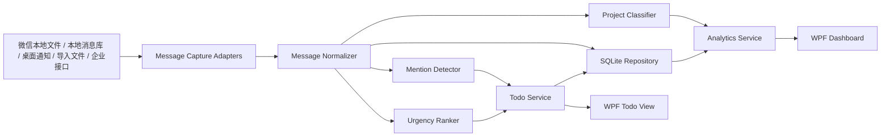
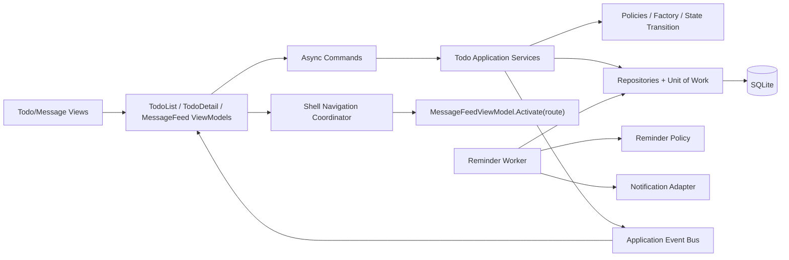

# 微信消息监控桌面软件设计文档

## 1. 背景与目标

用户微信群数量多，项目消息分散，容易漏掉群内 `@我`、紧急事项和跨项目待办。本系统面向 Windows 桌面环境，使用 WPF 技术栈构建一个本地消息监控与分析工具，将微信消息采集、待办提取、项目分类、紧急度排序和多维统计看板整合在一个桌面应用中。

核心目标：

1. 监控用户授权范围内的微信消息，优先发现群聊中 `@我` 的消息。
2. 将所有 `@我` 消息自动加入 Todo 清单的“待办理”状态。
3. 将非 `@我` 消息按项目、类别和规则进行归类。
4. 对消息和待办按紧急程度排序，帮助用户先处理高优先级事项。
5. 提供按项目、时间、类别、状态、紧急程度等维度的统计看板。
6. 数据默认保存在本机 SQLite 数据库中，避免默认上传敏感聊天内容。

范围说明：

1. 本文中的“所有微信消息”指当前用户授权、且能通过合规采集适配器获取到的消息集合，包括本机微信已同步或已缓存到本地的数据。
2. 本文中的“所有 `@我` 消息”指已采集消息中命中 `@我` 识别规则的全部消息。
3. 系统不承诺突破微信个人版未公开接口或安全机制来读取不可访问的全量历史消息。

## 2. 合规边界与设计原则

微信个人版没有公开的全量消息读取接口，因此系统必须将消息采集设计为可插拔适配器。当前主线从“屏幕 OCR 读取”调整为“本地文件或本地消息库读取优先，OCR 兜底”，但仍必须坚持用户授权、只读、本地执行和可审计的边界。

设计边界：

1. 系统只处理当前用户在本机、本人账号、明确授权范围内的消息。
2. 默认优先采用本地文件、本地消息库只读快照、外部导出 JSONL、通知监听、用户主动导入、企业合规接口等方式采集消息。
3. 不设计微信账号密码采集，不保存微信登录凭据。
4. 微信登录密码不能用于解密本地数据库，系统不接收、不保存、不尝试使用登录密码。
5. WPF 主程序不内置 Hook、注入或不可审计的逆向逻辑。数据库密钥获取必须封装在隔离的 `IWeChatDatabaseKeyProvider` 后面；默认保留只读内存扫描方案，也允许在用户逐次明确授权后调用独立进程形式的外部 Hook 提取器。
6. 数据库密钥、salt、内存地址和原始聊天正文不得写入应用日志、诊断摘要、项目目录或 Git 仓库。
7. 涉及群聊和个人消息的内容默认只保存在本地；如后续接入 AI 云服务，必须提供显式开关、脱敏策略和风险提示。
8. 未经来源、哈希、许可证和安全审查的第三方 DLL 不得打包进 WPF 主程序；外部密钥工具必须可替换、可禁用，并与消息解析器解耦。

产品能力分级：

| 等级 | 能力 | 说明 |
| --- | --- | --- |
| MVP | 手动导入、JSONL 导入、本地导出文件采集、重点消息 Todo 化 | 先验证消息流水线、去重、`@我` 和看板闭环 |
| 标准版 | 微信本地文件/本地库采集、规则配置、消息补偿扫描 | 微信最小化或被遮挡时仍可采集本机已缓存消息 |
| 企业版 | 对接企业微信、机器人、组织批准的数据接口 | 适合公司内部项目消息治理 |

## 3. 总体架构

系统采用 WPF + MVVM + 本地 SQLite 的桌面应用架构，分为表现层、应用服务层、领域层和基础设施层。



分层说明：

| 层级 | 职责 | 典型模块 |
| --- | --- | --- |
| Presentation | WPF 页面、控件、ViewModel、用户交互 | TodoView、MessageFeedView、DashboardView、SettingsView |
| Application | 编排业务流程和后台任务 | MessagePipelineService、TodoService、AnalyticsService |
| Domain | 业务模型与规则 | Message、TodoItem、Project、UrgencyScore、ClassificationResult |
| Infrastructure | SQLite、采集适配器、配置、日志、通知 | SqliteRepository、WeChatLocalDatabaseAdapter、WeChatUiaOcrAdapter、NotificationAdapter |

推荐技术栈：

| 类别 | 方案 |
| --- | --- |
| UI | WPF、MVVM、CommunityToolkit.Mvvm |
| 后台任务 | .NET Generic Host、BackgroundService、Channel 队列 |
| 数据库 | SQLite、Microsoft.Data.Sqlite、EF Core SQLite 或 Dapper |
| 图表 | LiveCharts2、OxyPlot 或同类 WPF 图表库 |
| 日志 | Serilog，本地滚动日志文件 |
| 配置 | appsettings.json + 用户配置表 |
| 隐私保护 | Windows DPAPI 加密敏感配置；可选 SQLCipher 保护本地数据库 |

## 4. 核心功能设计

### 4.1 消息采集

消息采集层使用 Adapter 模式，避免把系统绑定到单一采集方式。

接口设计：

```csharp
public interface IMessageCaptureAdapter
{
    string Name { get; }
    Task<IReadOnlyList<CapturedMessage>> CaptureAsync(CaptureContext context, CancellationToken cancellationToken);
}
```

适配器类型：

| 适配器 | 用途 | 备注 |
| --- | --- | --- |
| WeChatLocalExportAdapter | 读取本地导出工具生成的 JSONL 或 JSON 消息文件 | 第一优先级，风险低，便于快速验证微信最小化采集 |
| WeChatLocalDatabaseAdapter | 只读读取本机微信已缓存的本地消息文件或本地消息库快照 | 标准版目标，窗口最小化、被遮挡不影响采集 |
| WeChatUiaOcrAdapter | 通过 Windows UI Automation + OCR 读取当前可见微信窗口文本 | 作为诊断和兜底，不作为微信主采集路径 |
| WindowsNotificationAdapter | 捕获系统通知中的新消息摘要 | 覆盖新消息提醒，但内容可能不完整 |
| ManualImportAdapter | 支持用户导入 CSV、文本、截图 OCR 结果或企业导出的消息文件 | 适合补录历史消息 |
| EnterpriseApiAdapter | 对接组织批准的企业微信或机器人消息接口 | 适合企业环境，权限清晰 |

采集策略：

1. 微信来源默认优先使用 `WeChatLocalExportAdapter` 或 `WeChatLocalDatabaseAdapter`，`WeChatUiaOcrAdapter` 只作为诊断和兜底。
2. 通过 `source_message_key` 做去重，防止同一条消息重复入库。
3. 保存采集偏移量 `processing_offsets`，重启后从上次位置继续。
4. 采集异常只影响对应适配器，不阻塞其他适配器和 UI。
5. 本地文件采集默认只读，先复制或读取快照，不修改微信原始文件。
6. UI Automation + OCR 只读取当前用户可见窗口内容，不做隐藏式监听。

#### 4.1.1 微信本地文件/本地库采集

该方案是后续微信采集主线。它不依赖屏幕像素，因此微信窗口最小化、被其他窗口遮挡或切到后台时，仍有机会读取本机已经接收并缓存到本地的消息。

阶段划分：

1. **本地导出桥接阶段**：WPF 配置本地导出工具路径或导出目录，工具输出 JSONL/JSON，系统通过 `WeChatLocalExportAdapter` 转换为 `CapturedMessage`。该阶段不在主程序中实现微信库解析，优先验证增量采集、去重、`@我` Todo 和看板刷新。
2. **本地库只读阶段**：通过隔离的 `wechat-local-reader` 进程完成密钥获取、数据库快照、解密、V4 分片索引和结构化消息输出。WPF 只负责启动工具、传入 offset 和解析结果，不在主进程保存或打印数据库密钥。读取器不修改微信原始文件。
3. **多源本地采集阶段**：沉淀 `ExternalCommandCaptureAdapter`、`LocalFileWatchCaptureAdapter`、`LocalDatabaseCaptureAdapter`，让飞书、石化通、钉钉也能按本地文件、外部命令、官方 API 或可见窗口等方式接入。

本地消息映射：

| 微信本地数据 | 系统字段 | 说明 |
| --- | --- | --- |
| 消息唯一 ID 或组合键 | SourceMessageKey | 跨重启去重的核心字段 |
| 会话 ID | ChatId | 群聊或单聊稳定标识 |
| 会话名称 | ChatName | 用于项目分类和看板展示 |
| 发送人 ID 或昵称 | SenderName | 群聊中尽量保留真实发送人 |
| 消息正文或摘要 | Content | 文本、引用摘要、文件标题、链接标题 |
| 发送时间 | SentAt | 用于排序、统计和增量 offset |
| 消息类型 | MessageType | Text、Image、File、Link、System |

非文本消息第一阶段处理为摘要：图片记为 `[图片]`，文件记录文件名和大小，链接记录标题和 URL，语音和视频先记录占位摘要，撤回和系统通知默认不生成 Todo。

增量采集要求：

1. 优先使用微信本地消息唯一 ID。
2. 没有唯一 ID 时，使用 `账号 + 会话 ID + 发送时间 + 发送人 + 内容 hash` 生成稳定键。
3. offset 至少保存 `source`、账号标识、最后消息时间、最后消息键和按会话推进的位置。
4. 同一导出文件重复读取时不能重复入库。
5. 外部工具失败、输出格式错误、版本不兼容、目录不存在等问题必须显示在采集诊断页，不导致 WPF 崩溃。

当前默认本地导出目录：

```text
tools\result\capture-inbox\WeChatLocalExport
```

第一阶段已支持 JSONL/JSON 中常见字段名映射，例如 `msgId`、`messageId`、`chatId`、`talker`、`roomName`、`senderName`、`sender`、`content`、`message`、`createTime`、`timestamp`、`msgType`。

当前真实环境已定位：

```text
微信版本：4.1.10.31
数据目录：D:\cache\xwechat_files\dsfgis_84f8\db_storage
主消息库：D:\cache\xwechat_files\dsfgis_84f8\db_storage\message\message_0.db
读取工具：tools\wechat-local-reader\wechat-local-reader.exe
```

本地库文件是加密格式。首次初始化必须由用户明确授权选用一种数据库密钥提供器。密钥只保存在应用本机工具目录的受保护配置中，不进入应用日志、SQLite 消息库、项目目录或 Git 仓库。初始化完成前，`WeChat.LocalDatabase` 保持禁用。

#### 4.1.2 WeTrace 方案调研与借鉴边界

2026-06-10 对 [afumu/wetrace](https://github.com/afumu/wetrace/tree/main/docs) 的文档和 `main` 分支源码进行了方案调研。可借鉴的是它已经验证过的端到端数据链，而不是直接复制其 UI 或把未知二进制嵌入本程序。

确认的有效链路：

1. 获取当前账号的 32 字节数据库主密钥。
2. 从账号目录的 `db_storage` 下发现全部数据库文件。
3. 使用每个数据库首页自己的 16 字节 salt，从同一个主密钥分别派生页加密密钥和 HMAC 密钥。
4. 将数据库解密到保持原始目录结构的工作目录，例如 `session/session.db`、`contact/contact.db`、`message/message_0.db`。
5. 从 `SessionTable` 读取会话，以 `MD5(username)` 生成 `Msg_<32位小写十六进制>` 表名。
6. 在 `message_N.db` 分片中查询消息，并通过 `Name2Id` 解析发送人。
7. 数据库同步后重载分片索引，使新增或更新的数据库立即可查询。

与当前实现的关键差异：

1. WeTrace 的数据库主密钥获取使用独立 `wx_key.dll` 的 DLL 注入和 Hook；当前 `wechat-local-reader` 使用只读进程内存候选扫描。
2. WeTrace 明确区分“数据库主密钥”和“每个数据库按 salt 派生的页密钥”；当前实现必须避免把单库派生密钥误当作所有数据库通用密钥。
3. WeTrace 先解密完整数据库集合，再构建会话和消息分片索引；当前实现不能只验证 `message_0.db` 或只依赖最近会话摘要。
4. WeTrace 首次加载面向完整历史数据库；当前读取器首次默认只回看五分钟，会把“历史消息未导入”误判成“没有聊天消息”。
5. WeTrace 的源码仓库采用 `CC BY-NC-SA 4.0`，并且真正执行 Hook 的 `wx_key.dll` 未提交到源码仓库。项目只借鉴公开的数据流程、接口边界和表结构认识，不直接复制其实现或分发该 DLL。

第三方工具接入约束：

1. 不在 WPF 进程内加载第三方密钥 DLL。
2. 外部 Hook 提取器必须以独立进程运行，并通过最小 JSON 协议返回成功状态或受保护的密钥引用。
3. 每次涉及重启微信、注入或 Hook 时必须单独提示并取得用户确认。
4. 必须记录工具名称、版本、SHA-256 和来源，但不能记录提取到的密钥。
5. 未通过许可证和安全审查时，只允许用户自行配置外部工具路径，不随安装包分发。

本项目落地方案：

1. 把 WeTrace 证明有效的“密钥获取 -> 全库解密 -> V4 会话和分片读取”作为本地数据库采集主线，替代继续堆叠 UIA/OCR 或单点内存扫描。
2. WPF 主程序只编排采集，不持有逆向实现；所有密钥获取实现都挂在 `IWeChatDatabaseKeyProvider` 后面。
3. 默认仍保留只读内存扫描作为低侵入诊断路径；当它无法拿到主密钥时，允许用户选择“手动导入 DB Key”或“调用外部 Key 工具”。
4. 外部 Key 工具只作为用户本机显式授权的独立进程运行，统一放在项目 `tools\wx-key-tools` 下；生成的 key、日志、配置、解密库统一写入 `tools\result`。
5. 读取器拿到 64 位十六进制主密钥后，必须对 `session`、`contact` 和至少一个 `message` 数据库分别校验；校验失败时不得继续解析消息，也不得把失败折叠成“采集 0 条”。

外部工具选择（更新于 2026-06-27）：

1. `ylytdeng/wechat-decrypt` 的 Windows key 提取路径仍然是扫描 `Weixin.exe` 进程内存中的 SQLCipher raw key 模式，和当前只读扫描方案同类。它适合作为数据库结构、SQLCipher 参数和导出链路参考，但不是当前 key 获取失败的首选替代方案。
2. `gzygood/DbkeyHook` 的 README 明确指出 PC 微信 `4.0.3.39` 以后 dbkey 使用后会释放，以往搜索内存的方法不再能够找到 dbkey；该项目通过 Hook 初始化数据库获取 key。其 release `v1.0.4` 提供 `DbkeyHookCMD.exe`，说明支持微信 `4.1.x`，并支持 `-pid` 指定已打开微信进程。
3. 因此当前外部 Provider 优先适配 `DbkeyHookCMD.exe -pid {pid}` 这类命令行工具。项目只负责调用用户配置的命令、解析 stdout 或 `dbkey.txt` 中的 64 位十六进制 key，并继续执行自己的多库校验、快照、解密和消息读取。
4. `DbkeyHook` 当前仓库未声明许可证，且 release 是外部二进制；在完成来源、哈希和许可证审查前，不能把它纳入安装包或仓库，只能由用户自行下载、配置路径并逐次授权运行。

#### 4.1.3 微信 4.x 密钥提供器与初始化

密钥获取从固定实现改为可插拔提供器：

| Provider | 作用 | 默认状态 |
| --- | --- | --- |
| `ReadOnlyMemoryKeyProvider` | 保留当前只读扫描和数据库首页校验能力 | 可用，作为低侵入方案和诊断手段 |
| `ExternalHookKeyProvider` | 调用经用户配置、版本匹配的独立密钥提取工具 | 默认禁用，逐次授权 |
| `ImportedKeyProvider` | 导入用户从可信工具获得的 64 位十六进制主密钥 | 默认禁用，显式操作 |

外部 Key 工具协议：

1. WPF 配置项只保存工具命令、版本信息和用户授权状态，不保存明文密钥；明文主密钥只允许通过进程 stdout 或受保护临时通道传给读取器。
2. 推荐 stdout 返回 JSON：

   ```json
   {
     "ok": true,
     "provider": "external-hook",
     "version": "1.0.0",
     "wechat_version": "4.1.10.31",
     "db_key": "<64 hex chars>"
   }
   ```

3. 为兼容用户已有工具，也允许 stdout 中包含 `DB Key: <64 hex chars>` 这类纯文本输出；读取器只提取 64 位十六进制主密钥，不把完整 stdout 写入日志。
4. 失败时返回 `{"ok": false, "error_code": "...", "message": "..."}` 或非零退出码；诊断页显示错误分类和工具元信息，不显示 stdout/stderr 原文中的敏感片段。
5. 外部工具命令必须可禁用、可清空、可替换；用户切换微信版本或账号目录后必须重新校验主密钥。
6. 命令行支持 `{pid}` 或 `{wechat_pid}` 占位符；读取器会按检测到的 `Weixin.exe` 进程逐个尝试，例如 `"D:\tools\DbkeyHookCMD.exe" -pid {pid}`。
7. 如果外部工具只把 key 写入文件，读取器允许配置 Key 文件路径，例如 `D:\Program Files (x86)\Tencent\Weixin\dbkey.txt`，并从该文件提取 64 位十六进制 key。

统一初始化流程：

1. 定位账号目录和 `db_storage`，记录账号目录标识，不记录聊天内容。
2. 由选定 Provider 获取 32 字节数据库主密钥候选。
3. 使用 `session/session.db`、`contact/contact.db` 和至少一个 `message/message_N.db` 首页分别验证候选。
4. 对每个数据库按其首页 salt 执行 `PBKDF2-HMAC-SHA512` 256000 次派生页密钥。
5. 将 salt 每字节异或 `0x3A`，再执行 2 次 PBKDF2 派生 HMAC 密钥，并验证数据库页 HMAC。
6. 只有会话库、联系人库和至少一个消息库全部验证通过，初始化才算成功。
7. 主密钥使用 Windows DPAPI 或等价机制保护；派生密钥缓存必须可删除和重新生成。
8. 初始化命令只输出阶段状态、数据库数量、验证数量和耗时，不输出密钥、salt、内存地址或聊天正文。

当前只读扫描实现保留以下约束：

1. 枚举本机正在运行的 `Weixin.exe`，只申请 `PROCESS_VM_READ | PROCESS_QUERY_INFORMATION`。
2. 分块读取已提交、可读、私有内存，不写入或修改微信进程。
3. 识别微信 4.x 的 32 字节密钥结构、无包装 ASCII/UTF-16 十六进制候选，并允许容量字段随微信版本变化。
4. 先把候选作为已派生页密钥直接验证，再按微信 4.x 参数执行 `PBKDF2-HMAC-SHA512` 256000 次派生并验证。
5. 未通过多个必需数据库验证的候选不得持久化。

当前验证状态（更新于 2026-06-10）：

1. 已确认微信版本为 `4.1.10.31`，数据库目录和消息库持续更新。
2. 旧版 `x'<64hex_key><32hex_salt>'` 文本模式未在五个微信进程中出现。
3. 固定容量 `0x2F` 的微信 4.x 指针结构产生候选，但没有候选通过数据库校验。
4. 无包装 ASCII/UTF-16 十六进制候选也没有通过直接页密钥或原始口令校验。
5. 当前只读扫描路径尚未取得可用主密钥；不再继续把调整内存模式作为唯一推进方向。
6. 下一步先实现 Provider 抽象和阶段化诊断，再接入用户授权的外部密钥工具进行对照验证。
7. 在主密钥验证、全库解密、会话读取、消息分片匹配和真实消息读取全部通过前，系统不能宣称已经支持后台读取微信消息。

因此，当前“采集不到微信聊天消息”的直接原因不应再按 OCR 或消息表字段优先排查。只要主密钥没有通过多库校验，后续 `SessionTable`、`Msg_<md5(username)>` 和 `Name2Id` 读取都不会进入可信状态。下一阶段的关键路径是先让 `ImportedKeyProvider` 或 `ExternalHookKeyProvider` 提供可验证主密钥，再复用现有解密和分片读取链路。

#### 4.1.4 数据库快照、解密和 V4 消息读取

本地读取器必须将密钥获取、数据库解密和消息解析拆成可独立验证的阶段。

数据库发现与快照：

1. 配置保存账号目录，例如 `D:\cache\xwechat_files\dsfgis_84f8`；读取器统一解析其下的 `db_storage`，同时兼容用户直接选择 `db_storage`。
2. 递归发现 `.db` 文件，至少要求 `session/session.db`、`contact/contact.db` 和一个 `message/message_N.db`。
3. 读取前先复制稳定快照到临时目录，避免直接读取微信正在写入的文件。
4. 使用相对路径、文件大小、修改时间和首页指纹判断数据库是否变化，只重新处理变化文件。
5. 解密文件先写临时路径，验证 SQLite 文件头、必需表和可选 `PRAGMA quick_check` 后再原子替换工作副本。

V4 会话与消息索引：

1. 从 `session/session.db` 的 `SessionTable` 读取 `username`、`last_timestamp`、`summary` 等会话字段。
2. 消息分片识别 `message.db` 和 `message_N.db`，优先读取 `Timestamp` 元数据，必要时兼容 `DBInfo`。
3. 会话对应表名为 `Msg_` 加 `MD5(username)` 的 32 位小写十六进制值。
4. 消息查询读取 `local_id`、`server_id`、`local_type`、`sort_seq`、`real_sender_id`、`create_time`、`message_content`、`compress_content`、`packed_info_data` 和 `status`。
5. 使用同一消息库中的 `Name2Id` 解析 `real_sender_id`；群聊正文仍需兼容 `sender:\ncontent` 形式。
6. 文本内容支持普通 UTF-8 和 zstd 压缩；媒体消息第一阶段只生成摘要，不阻塞文本消息采集。
7. `SessionTable` 只用于发现和优化，不作为消息存在性的唯一依据；会话索引异常时允许扫描已识别分片中的 `Msg_*` 表做诊断。

首次导入与增量策略：

1. 首次初始化默认执行可配置的历史导入，不再固定只回看五分钟。
2. 历史导入支持“最近 7 天”“最近 30 天”“全部历史”三种范围，默认最近 30 天。
3. 增量 offset 保存 `account + shard + table + create_time + local_id/server_id` 高水位，并保留短时间回看窗口处理乱序写入。
4. 数据库更新后先完成快照和增量解密，再重建变化分片索引，最后查询新增消息。
5. `SourceMessageKey` 优先使用 `username + database + server_id`；没有 `server_id` 时回退到 `username + database + local_id + create_time`。

#### 4.1.5 阶段化诊断与验收

采集诊断不能再把所有失败折叠成“采集 0 条”。每次运行至少输出以下非敏感阶段：

| 阶段 | 必需诊断 |
| --- | --- |
| 账号路径 | 账号目录、`db_storage` 是否存在、发现数据库数量 |
| 密钥 Provider | Provider 名称、工具版本、是否授权、执行状态 |
| 密钥验证 | 会话库、联系人库、消息库验证通过数量 |
| 快照与解密 | 变化文件数、成功数、失败文件相对路径和错误分类 |
| Schema | `SessionTable`、`Name2Id`、`Msg_*` 表数量 |
| 分片索引 | 已识别分片数、被跳过分片数、时间范围 |
| 消息查询 | 候选会话数、匹配消息表数、读取行数、标准化行数 |
| Pipeline | 去重数、入库数、Todo 创建数、下一 offset |

验收顺序：

1. 使用离线加密测试库验证主密钥派生、HMAC 和逐页解密。
2. 使用脱敏的 V4 SQLite fixture 验证 `SessionTable`、`Msg_<md5>`、`Name2Id` 和 zstd 内容解析。
3. 在真实机器上只验证数据库数量、表数量、时间范围和消息数量，不在开发日志中输出正文。
4. 首次历史导入成功后，发送一条已知测试消息，验证增量同步和去重。
5. 最小化微信窗口重复测试，确认采集不依赖 UIA/OCR。
6. 最后验证 `@白驹过隙`、`@戴少峰` Todo 创建和 WPF 看板刷新。

#### 4.1.6 当前实现状态（2026-06-30）

当前项目已经从“是否能拿到 DB Key”推进到“已能用 DB Key 读取本地微信消息并在 WPF 表格展示”的阶段。这里记录新工作树接手时的真实状态，避免把旧的 OCR 或内存扫描问题当成主线继续排查。

已实现能力：

1. `tools\wx-key-tools\run-wx-key-probe.ps1` 调用项目内 `wx_key` 工具，将 DB Key 写入 `tools\result\wechat-local-reader\wx-key-found.txt`。
2. WPF 顶部 `自动提取Key` 会自动选择当前 `Weixin` 进程，调用 PowerShell 探测脚本，并把 Key 文件路径回填到界面。
3. `WeChatLocalReaderService` 支持使用 Key 文件初始化本地读取器，生成 `config.json`、`all_keys.json` 和解密工作目录，全部位于 `tools\result\wechat-local-reader`。
4. Python reader 已支持 `init` 和 `capture` 两类命令，`capture` 支持 `--start-timestamp`、`--end-timestamp`、`--offset`、`--limit`，可用于按日期和分页读取。
5. WPF `微信消息` tab 已提供 `读取当天消息`、`上一页`、`下一页`，默认读取当天消息，每页 50 条。
6. 表格字段已经按当前需求固定为 `消息内容`、`群名称`、`发消息人`。
7. 读取器会在输出前把非文本 XML 元数据转成可读摘要，避免 UI 直接显示 XML。当前摘要包括 `[图片]`、`[视频]`、`[表情]`、`[文件]`、`[链接] 标题 - 描述`、`[位置]`。
8. Python stdout/stderr 已强制 UTF-8/安全转义，WPF 调用时设置 `PYTHONUTF8=1` 和 `PYTHONIOENCODING=utf-8:backslashreplace`，避免 Windows GBK 控制台遇到特殊字符时报错。
9. 单元测试覆盖本地读取器 key 导入、V4 结构读取、分页参数、GBK 输出规避和 XML 摘要；.NET 测试覆盖 WPF 服务层读取当天消息分页。

当前边界：

1. DB Key 获取依赖外部 `wx_key` 工具，不应在 WPF 进程内加载第三方 Hook DLL。
2. `tools\wx-key-tools` 作为项目内本地工具目录存在，但提交或分发前必须补充来源、版本、SHA-256、许可证和安全审查结论。
3. `tools\result` 下可能包含 DB Key、派生 key、解密数据库和真实消息内容，必须保持 gitignore，不能提交。
4. `微信消息` tab 当前直接读取本地数据库分页结果；`采集一次` 和 `开始微信监听` 仍走 `MessageCapturePipeline`，两条路径后续需要统一用户体验和状态展示。
5. 非文本消息当前显示摘要，不下载或渲染图片、视频、表情、文件本体。
6. 当前实现证明“拿到 DB Key 后可以读取本地消息”，但正式完成仍需补齐最小化微信增量验证、外部工具合规记录、错误诊断分层和用户可配置的数据目录。

新工作树优先级：

1. 先运行 `design/wechat-local-database-system-test.md` 中的非敏感测试步骤，确认本机仍能初始化和读取消息。
2. 如果 UI 显示 XML 原文，优先检查 `tools\wechat-local-reader\wechat_local_reader.py` 的 `summarize_message_content` 是否在消息输出前被调用。
3. 如果读取失败，优先区分 DB Key 文件不存在、key 与账号目录不匹配、解密失败、schema 查询失败和 WPF JSON 解析失败，不要直接回退到 OCR 排查。
4. 提交前确认没有把 `tools\result`、`wx-key-found.txt`、`all_keys.json`、解密数据库或真实消息 JSON 加入 Git。
### 4.2 消息标准化

不同来源的消息统一转成内部模型：

```csharp
public sealed class Message
{
    public long Id { get; init; }
    public string Source { get; init; } = "";
    public string SourceMessageKey { get; init; } = "";
    public string ChatId { get; init; } = "";
    public string ChatName { get; init; } = "";
    public string SenderName { get; init; } = "";
    public string Content { get; init; } = "";
    public DateTimeOffset SentAt { get; init; }
    public DateTimeOffset CapturedAt { get; init; }
    public MessageType MessageType { get; init; }
}
```

标准化规则：

1. 统一时间格式，全部存储为 UTC 时间戳，同时保留本地展示时区。
2. 统一群名、发送人、消息内容、来源和消息类型。
3. 对图片、文件、链接等非文本消息保存摘要和元数据，不默认保存二进制内容。
4. 对空白、撤回、系统提示等消息打类型标签，便于统计时过滤。

### 4.3 `@我` 识别与 Todo 自动生成

`@我` 识别基于别名集合、群内昵称和微信界面可见提示。

识别信号：

1. 消息内容包含 `@我`、`@你`、`@当前昵称`、`@姓名`、`@英文名` 等别名。
2. 微信窗口或通知中出现“有人@我”的提示。
3. 重点群配置中指定“所有提到某关键字均视为待办”。
4. 发送人是重点联系人且内容包含动作词，例如“请处理”“帮看下”“今天给反馈”。

Todo 生成规则：

1. 命中 `@我` 的消息自动创建 Todo，状态为 `Pending`。
2. 如果同一 `source_message_key` 已创建 Todo，则不重复创建。
3. Todo 标题从消息内容自动截取，默认长度不超过 80 字。
4. Todo 保留原始消息链接、群名、发送人、上下文消息 ID、项目分类和紧急度。
5. 用户可以手动修改 Todo 标题、项目、截止时间、备注和状态。

Todo 状态：

| 状态 | 含义 |
| --- | --- |
| Pending | 待办理 |
| InProgress | 处理中 |
| Waiting | 等待他人 |
| Done | 已完成 |
| Ignored | 已忽略 |

### 4.4 项目分类

项目分类采用“规则优先、模型辅助、人工修正闭环”的策略。

分类信号：

| 信号 | 示例 | 权重 |
| --- | --- | --- |
| 群聊映射 | 某微信群固定属于 A 项目 | 高 |
| 关键词 | 项目代号、客户名、系统名、需求编号 | 高 |
| 发送人 | 项目经理、客户接口人、核心开发 | 中 |
| 消息上下文 | 同一会话最近消息所属项目 | 中 |
| 用户修正 | 用户手动改过分类 | 最高 |

分类流程：

1. 先检查群聊与项目的固定映射。
2. 再匹配项目关键词、别名、客户名、系统名称。
3. 对无法确定的消息进入 `Unclassified`。
4. 用户在界面修正分类后，系统记录为规则候选。
5. 可选接入本地或云端 AI 分类器，但默认不开启云端发送。

分类输出：

```csharp
public sealed class ClassificationResult
{
    public long MessageId { get; init; }
    public long ProjectId { get; init; }
    public string Category { get; init; } = "";
    public decimal Confidence { get; init; }
    public string Reason { get; init; } = "";
    public string Classifier { get; init; } = "Rules";
}
```

类别建议：

| 类别 | 说明 |
| --- | --- |
| Requirement | 需求、变更、业务诉求 |
| Incident | 故障、线上问题、阻塞 |
| Meeting | 会议、评审、同步 |
| Delivery | 交付、上线、验收 |
| Question | 咨询、答疑 |
| FYI | 通知、同步信息 |

### 4.5 紧急程度排序

紧急度计算输出 0 到 100 分，并映射为 P0 到 P3。

评分信号：

| 信号 | 加分示例 |
| --- | --- |
| `@我` | +30 |
| 包含紧急词 | “紧急”“马上”“今天”“阻塞”“线上故障” |
| 明确截止时间 | “下班前”“今天 18 点”“明早前” |
| 重点项目 | 核心项目、上线项目 |
| 重点联系人 | 领导、客户、项目经理 |
| 消息类型 | 故障类、交付类优先 |
| 时间衰减 | 超过 SLA 未处理继续升权 |

优先级映射：

| 分数 | 优先级 | 处理建议 |
| --- | --- | --- |
| 85-100 | P0 | 立即处理 |
| 65-84 | P1 | 当天优先处理 |
| 40-64 | P2 | 纳入今日或近期计划 |
| 0-39 | P3 | 低优先级关注 |

排序规则：

1. Todo 默认按 `priority DESC, due_at ASC, captured_at DESC` 排序。
2. P0 消息触发桌面提醒和托盘高亮。
3. 同一项目内优先显示未完成、超时、`@我` 的事项。
4. 用户手动调整优先级后，手动值优先于自动评分。

### 4.6 多维统计看板

看板用于快速回答“哪些项目最忙、哪些事项最急、哪些消息还没处理、最近趋势如何”。

主要视图：

| 看板 | 指标 |
| --- | --- |
| 今日概览 | 今日消息数、`@我` 数、待办理数、P0/P1 数、已完成数 |
| 项目看板 | 各项目消息量、待办量、未完成量、紧急事项数 |
| 时间趋势 | 按小时、日、周统计消息和待办趋势 |
| 类别分布 | 需求、故障、会议、交付、咨询、通知占比 |
| SLA 看板 | 超时待办、平均响应时间、平均完成时间 |
| 未分类消息 | 无法归类消息量、建议新增规则 |

筛选维度：

1. 项目。
2. 时间范围。
3. 群聊。
4. 发送人。
5. 类别。
6. 优先级。
7. Todo 状态。
8. 是否 `@我`。

### 4.7 下一阶段功能闭环（2026-08-08）

下一阶段不优先继续扩充采集平台，而是先把现有消息、分类、待办和看板数据形成可持续使用的处理闭环。功能优先级如下：

| 优先级 | 功能 | 目标 |
| --- | --- | --- |
| P0 | Todo 工作台 | 支持手动创建、编辑标题与备注、项目、优先级、截止时间、五种状态、重新打开和跳回原消息 |
| P0 | 可靠采集与真实诊断 | 保证消息、分类、评分和 Todo 原子写入，并显示每个 Adapter 的真实成功、失败和重试状态 |
| P1 | 全文搜索与组合筛选 | 按正文、群名、发送人、来源、项目、日期、`@我`、优先级和 Todo 状态检索 |
| P1 | 桌面提醒与托盘 | 对新 `@我`、P0/P1、即将到期、已逾期和采集异常提供可配置通知 |
| P1 | 规则中心与解释 | 统一配置项目关键词、重点联系人、紧急词和权重，支持规则试算、原因展示及历史重算 |
| P2 | 项目日报与周报 | 汇总新增事项、已完成、未完成、风险、关键决策和截止日期，导出 Markdown、Excel 或 Word |
| P2 | 数据管理 | 支持版本迁移、完整性检查、按时间清理、备份、恢复和加密备份 |

Todo 工作台交互要求：

1. Todo 详情以原始消息为事实来源，展示来源、群名、发送人、发送时间和完整正文。
2. 自动生成的 Todo 可编辑，但不得覆盖或篡改原始消息；人工字段与原消息字段分开保存。
3. `Pending`、`InProgress`、`Waiting`、`Done`、`Ignored` 均需持久化，支持从 `Done` 或 `Ignored` 重新打开。
4. 到期提醒支持免打扰时段、延后提醒和按来源或群聊关闭，避免高频通知造成干扰。

搜索与报告要求：

1. 消息搜索使用 SQLite FTS5，筛选条件继续使用普通索引；查询结果按 `sent_at DESC, id DESC` 稳定排序。
2. 搜索结果可直接转为 Todo、加入项目规则或打开原消息上下文。
3. 日报和周报第一版使用本地规则与结构化聚合生成；可选 AI 总结默认关闭。
4. 任何云端 AI 分析必须由用户显式开启，并在发送前展示数据范围、脱敏策略和风险提示。

## 5. WPF 界面设计

主窗口采用左侧导航 + 顶部状态栏 + 右侧内容区布局。

导航项：

| 页面 | 说明 |
| --- | --- |
| 待办理 | 展示自动生成和手动创建的 Todo |
| 消息流 | 查看按时间排序的消息，支持筛选和搜索 |
| 项目 | 按项目聚合消息、待办和风险 |
| 看板 | 多维统计和图表 |
| 规则 | 配置项目规则、关键词、别名、重点联系人 |
| 采集诊断 | 查看适配器状态、最近采集时间、错误日志 |
| 设置 | 隐私、数据库、提醒、备份、AI 开关 |

关键交互：

1. 双击 Todo 打开详情面板，展示原消息、上下文、项目、紧急度原因和操作历史。
2. 消息流支持右键“转为待办”“加入项目规则”“忽略类似消息”。
3. 项目页支持拖拽调整 Todo 状态。
4. 规则页支持测试规则，输入一条消息后展示分类和紧急度原因。
5. 采集诊断页展示每个 Adapter 的启用状态、最近成功时间、失败次数和错误摘要。

ViewModel 建议：

| ViewModel | 职责 |
| --- | --- |
| ShellViewModel | 导航、全局状态、托盘提醒 |
| TodoListViewModel | Todo 查询、筛选、状态变更 |
| MessageFeedViewModel | 消息列表、搜索、转待办 |
| DashboardViewModel | 聚合指标和图表数据 |
| RuleEditorViewModel | 项目规则、关键词、别名配置 |
| CaptureDiagnosticsViewModel | 采集适配器健康状态 |

### 5.1 Todo 工作台四项功能详细设计（2026-08-09）

本节最初用于先行设计，当前实现状态记录在 5.1.10。范围包括：任意消息转为待办、延后提醒、今日到期/已逾期分组、从待办详情跳回原始消息。实现时不得继续把仓储调用、业务判断和导航定位堆入 `MainWindow.xaml.cs`。

#### 5.1.1 已确认现状与设计约束

1. `TodoItem` 已有 `SourceMessageId` 和 `DueAt`，`messages` 是原始消息事实来源；详情页只读展示原消息，不把用户编辑反写到消息表。
2. 当前消息流行模型没有数据库消息 ID，主窗口直接处理待办完成、分页和仓储调用；新增功能前必须先引入可测试的 ViewModel 和应用服务边界。
3. 当前数据库初始化只使用 `CREATE TABLE IF NOT EXISTS`，尚无版本化 migration。新增提醒表、索引或列之前，必须先落地 migration 基础设施，不能依赖重新建库。
4. “今日到期”和“已逾期”是随当前时间变化的派生分组，不新增 Todo 状态，也不把分组名持久化。
5. “延后提醒”只改变下一次提醒时间，不改变 `DueAt`。如用户要修改截止时间，应使用独立的“修改截止时间”操作。
6. 第一版交互把一条原消息对应的既有 Todo 视为幂等结果：重复点击“转为待办”时打开已有 Todo，而不是静默创建重复项。领域模型不增加数据库唯一约束，以保留未来把一条消息拆成多个行动项的扩展空间；并发幂等由应用事务中的查询与插入保证。

#### 5.1.2 总体架构与设计模式



采用以下模式，并限制其使用目的：

| 模式 | 落点 | 解决的问题 |
| --- | --- | --- |
| MVVM | `TodoListViewModel`、`TodoDetailViewModel`、`MessageFeedViewModel` | 从窗口代码后置中移出状态、加载、校验和用户操作 |
| Command | `CreateTodoFromMessageCommand`、`SnoozeReminderCommand`、`NavigateToSourceCommand` | 统一异步执行、忙碌态、CanExecute 和错误呈现 |
| Application Service / Use Case | `TodoApplicationService`、`ReminderApplicationService` | 编排事务和跨仓储业务，不让 ViewModel 拼接流程 |
| Factory | `TodoFactory.CreateFromMessage` | 统一手动与自动 Todo 的标题、来源、项目和优先级默认值 |
| Policy / Strategy | `TodoDueBucketPolicy`、`ReminderSchedulePolicy`、`TodoStatusTransitionPolicy` | 隔离时区、分组、延期选项、状态流转等可变规则 |
| Repository + Unit of Work | `ITodoRepository`、`IReminderRepository`、`IMessageRepository`、`ITodoUnitOfWork` | 保证手动建 Todo 与初始提醒、延期状态更新的原子性 |
| Coordinator + Route | `IShellNavigationService`、`MessageContextRoute` | 跨页面导航并定位消息，不让 Todo 详情操纵 TabControl/DataGrid |
| Observer / Event Aggregator | `TodoCreatedEvent`、`TodoChangedEvent`、`ReminderChangedEvent` | 让列表、顶部计数和详情按事件刷新，避免彼此直接引用 |
| Adapter | `IUserNotificationPublisher` | 隔离 Windows Toast、托盘或仅应用内提示的实现差异 |
| Clock abstraction | `IClock`、`ITimeZoneProvider` | 让午夜切组、逾期判断、延期和补发提醒可确定性测试 |

不为五种 Todo 状态分别建立五个类。当前状态数量和转换规则较小，使用集中式 `TodoStatusTransitionPolicy` 更易审计；只有状态行为显著复杂后才升级为完整 State 对象。

#### 5.1.3 建议目录与主窗口边界

```text
src/WechatDashboard.App/
  Bootstrap/ApplicationCompositionRoot.cs
  Navigation/ShellNavigationService.cs
  Navigation/MessageContextRoute.cs
  Views/Todos/TodoListView.xaml
  Views/Todos/TodoDetailView.xaml
  Views/Messages/MessageFeedView.xaml
  ViewModels/ShellViewModel.cs
  ViewModels/Todos/TodoListViewModel.cs
  ViewModels/Todos/TodoDetailViewModel.cs
  ViewModels/Messages/MessageFeedViewModel.cs
  Behaviors/DataGridScrollIntoViewBehavior.cs
  Commands/AsyncRelayCommand.cs
src/WechatDashboard.Application/
  Todos/TodoApplicationService.cs
  Todos/TodoFactory.cs
  Todos/TodoDueBucketPolicy.cs
  Todos/TodoStatusTransitionPolicy.cs
  Reminders/ReminderApplicationService.cs
  Reminders/ReminderSchedulePolicy.cs
  Navigation/MessageContextQueryService.cs
src/WechatDashboard.Infrastructure/
  Persistence/SqliteTodoRepository.cs
  Persistence/SqliteReminderRepository.cs
  Persistence/SqliteTodoUnitOfWork.cs
  Notifications/WindowsToastNotificationPublisher.cs
  Background/ReminderWorker.cs
```

`MainWindow.xaml.cs` 最终只保留 `InitializeComponent` 以及无法用绑定/Behavior 表达的窗口生命周期桥接。依赖构造放到 `ApplicationCompositionRoot`；页面切换归 `ShellViewModel`；DataGrid 滚动定位归附加 Behavior；确认框和错误提示通过 `IDialogService` 调用。迁移应按页面逐步完成，禁止一次性重写整个主窗口。

#### 5.1.4 任意消息转为待办

入口：消息流行操作按钮和右键菜单均提供“转为待办”。其他消息页只有在消息已经进入规范化 `messages` 表并取得数据库 ID 后才启用此命令；不得按正文、发送人和时间模糊匹配原消息。

交互流程：

1. `MessageListItemViewModel` 必须携带 `MessageId`、`Source` 和 `SourceMessageKey`，命令参数只传稳定的 `MessageId`。
2. `CreateTodoFromMessageCommand` 打开轻量创建面板，使用 `TodoFactory` 预填标题、描述、分类项目、紧急度优先级，可选截止时间和首次提醒时间。
3. 用户确认后，`TodoApplicationService.CreateFromMessageAsync` 在事务中重新读取消息，检查既有 Todo，创建 Todo，并在用户选择提醒时同时创建首条 `Scheduled` reminder。
4. 如果已经存在关联 Todo，返回 `ExistingTodo` 结果并打开其详情；如果消息已被清理，返回 `SourceMessageMissing`，不创建悬空引用。
5. 创建成功发布 `TodoCreatedEvent`；消息行切换为“查看待办”，待办列表和顶部计数按事件增量刷新，必要时再执行查询校准。

建议用例契约：

```csharp
public sealed record CreateTodoFromMessageRequest(
    long MessageId,
    string? Title,
    string? Description,
    long? ProjectId,
    PriorityLevel? Priority,
    DateTimeOffset? DueAt,
    DateTimeOffset? FirstReminderAt);

public interface ITodoApplicationService
{
    Task<CreateTodoResult> CreateFromMessageAsync(
        CreateTodoFromMessageRequest request,
        CancellationToken cancellationToken);
}
```

手动转换和 `@我` 自动创建共享 `TodoFactory` 的字段生成规则，但触发策略不同：自动创建仍由采集事务触发，手动创建由用户命令触发；不要让 UI 直接调用现有静态 `TodoService.CreateFromMention`。

#### 5.1.5 今日到期与已逾期分组

待办理页面默认显示四个可折叠分组，防止只显示用户点名的两个分组后隐藏其他事项：

| 分组 | 判定（应用所在时区） | 默认排序 |
| --- | --- | --- |
| 已逾期 | `DueAt < now` | 截止时间最早、优先级最高在前 |
| 今日到期 | `now <= DueAt < nextLocalDayStart` | 最接近截止时间在前 |
| 后续到期 | `DueAt >= nextLocalDayStart` | 截止时间升序 |
| 无截止时间 | `DueAt is null` | 优先级、更新时间降序 |

仅 `Pending`、`InProgress`、`Waiting` 进入这些分组；`Done` 和 `Ignored` 留在历史/已办理视图。一个今天上午已过截止时间的 Todo 属于“已逾期”，不能同时出现在“今日到期”。

`TodoDueBucketPolicy` 接收 `IClock` 和 `ITimeZoneProvider` 后计算分组，分组值不写回数据库。`TodoListViewModel` 在页面激活、Todo 变化、应用从休眠恢复、系统时区变化以及跨越本地午夜时刷新；页面保持打开时以一分钟为最大刷新间隔，使刚过截止时间的事项及时移入“已逾期”。

#### 5.1.6 提醒与延后提醒

提醒是独立生命周期，不复用 `todo_items.status`。建议新增：

```sql
CREATE TABLE todo_reminders (
    id INTEGER PRIMARY KEY AUTOINCREMENT,
    todo_id INTEGER NOT NULL,
    scheduled_at TEXT NOT NULL,
    status TEXT NOT NULL,
    parent_reminder_id INTEGER NULL,
    delivered_at TEXT NULL,
    snoozed_at TEXT NULL,
    dismissed_at TEXT NULL,
    attempt_count INTEGER NOT NULL DEFAULT 0,
    last_error TEXT NULL,
    created_at TEXT NOT NULL,
    updated_at TEXT NOT NULL,
    FOREIGN KEY(todo_id) REFERENCES todo_items(id) ON DELETE CASCADE,
    FOREIGN KEY(parent_reminder_id) REFERENCES todo_reminders(id)
);

CREATE INDEX idx_todo_reminders_due
    ON todo_reminders(status, scheduled_at);
CREATE INDEX idx_todo_reminders_todo
    ON todo_reminders(todo_id, created_at DESC);
```

提醒状态为 `Scheduled`、`Dispatching`、`Delivered`、`Snoozed`、`Dismissed`、`Cancelled`。延期时在一个事务中把旧提醒标记为 `Snoozed`，并创建带 `parent_reminder_id` 的新 `Scheduled` 记录，从而保留完整历史。完成或忽略 Todo 时取消尚未发送的提醒；重新打开 Todo 不自动恢复旧提醒，详情页明确询问是否新建提醒。

默认延期选项由 `ReminderSchedulePolicy` 提供：10 分钟、30 分钟、1 小时、明天 09:00、自定义。所有选项最终转换为绝对 `DateTimeOffset` 存储；校验目标时间必须晚于当前时间。延期不修改 `DueAt`，即使延期时间晚于截止时间也允许，但 UI 要显示“提醒晚于截止时间”的非阻塞警告。

`ReminderWorker` 使用 `PeriodicTimer` 查询到期提醒，通过短事务原子领取 `Scheduled -> Dispatching`，再调用 `IUserNotificationPublisher`。发送成功转为 `Delivered`；失败记录脱敏错误并按退避策略重排，不在日志中写消息正文。应用启动或从休眠恢复时补领 `scheduled_at <= now` 的提醒，领取状态保证同一提醒不会重复弹出。第一版可以仅实现应用内通知，Windows Toast 作为 Adapter 后续接入，不影响用例层。

#### 5.1.7 从待办详情跳回原始消息

Todo 详情页展示 Todo 可编辑字段与原消息只读字段。仅当 `SourceMessageId` 存在且消息仍可查询时启用“查看原始消息”。导航流程如下：

1. `NavigateToSourceCommand` 构造 `MessageContextRoute(SourceMessageId)`，交给 `IShellNavigationService`。
2. `ShellViewModel` 切换到消息流页面，并调用 `MessageFeedViewModel.ActivateAsync(route)`；详情 ViewModel 不引用 `TabControl`、`DataGrid` 或主窗口。
3. `MessageContextQueryService` 按 ID 查询锚点消息及前后上下文，进入临时“原消息定位模式”。该模式不受当前关注群过滤影响，并显示“返回先前消息列表”横幅，避免来源消息因过滤条件被错误报告为不存在。
4. `MessageFeedViewModel` 设置 `SelectedMessageId`；`DataGridScrollIntoViewBehavior` 完成选中、滚动和短时高亮。
5. 原消息已按清理策略删除时，详情仍保留 Todo 人工字段，按钮禁用并显示“原始消息已不存在”，不得用 Todo 描述伪装成原文。

上下文查询使用 `(sent_at, id)` 作为稳定游标，默认返回锚点前后各 20 条。这样不依赖当前页大小，也避免为定位一条消息从第一页顺序翻页。

#### 5.1.8 数据迁移、并发与失败语义

1. 先增加 `schema_migrations` 和顺序 migration runner，再创建 `todo_reminders`；升级失败必须回滚并保留原库可重新尝试。
2. `ITodoUnitOfWork` 负责手动创建 Todo + 初始提醒、延期旧提醒 + 新提醒、完成 Todo + 取消提醒三类事务。
3. 保存详情和延期使用 `updated_at` 或新增 `row_version` 做乐观并发；冲突时重新加载并提示，不采用最后写入静默覆盖。
4. 重复“转为待办”由事务内 `GetBySourceMessageIdAsync` 返回已有项。暂不建立 `source_message_id` 唯一索引，因为未来可能允许把一条消息拆成多个行动项。
5. 所有时间以 ISO-8601 `DateTimeOffset` 持久化，分组边界通过用户当前时区计算；修改系统时区后立即重算，不批量改写历史值。

#### 5.1.9 测试与验收切片

单元测试：

1. `TodoFactory` 正确继承消息、分类和紧急度默认值，且不修改原消息。
2. `TodoDueBucketPolicy` 覆盖截止前一秒、恰好到期、今日末尾、跨午夜、夏令时和无截止时间。
3. `ReminderSchedulePolicy` 覆盖各延期预设、自定义时间和无效过去时间。
4. `TodoStatusTransitionPolicy` 覆盖完成/忽略时取消提醒以及重新打开规则。
5. ViewModel 命令覆盖忙碌态、CanExecute、取消和错误结果，不需要启动 WPF 窗口。

SQLite 集成测试：

1. 任意消息可创建 Todo；重复命令返回既有 Todo；消息不存在时不创建记录。
2. Todo 与首条提醒同事务提交，注入提醒写入失败时 Todo 也回滚。
3. 延期事务保留旧记录、创建新记录，且任一步失败时不出现两个有效提醒。
4. Worker 并发领取同一提醒时只有一个成功；应用重启后补发一次且不重复。
5. 完成/忽略 Todo 会取消未发送提醒；历史提醒仍可审计。
6. 原消息上下文查询以 ID 精确定位，在同一时间戳多条消息时仍稳定。

UI 验收：

1. 任意规范化消息均能转为待办，重复操作进入已有详情。
2. 待办理页至少展示已逾期、今日到期、后续到期、无截止时间四组，跨越截止时间后自动换组。
3. 详情可设置提醒并延后，界面明确区分截止时间和提醒时间。
4. 从详情可切换到消息流、加载上下文、选中并高亮原始消息；当前群过滤不会阻止定位。
5. 新功能的 View 和 ViewModel 不向 `MainWindow.xaml.cs` 新增仓储调用或业务分支；主窗口代码后置行数不得因本功能净增长。

#### 5.1.10 实现状态（2026-08-09）

已实现：

1. 新增 `schema_migrations` 与事务式 migration 1，创建 `todo_reminders`、外键和查询索引；所有 SQLite 连接显式启用外键和 `busy_timeout`。
2. 新增 `TodoFactory`、`TodoApplicationService`、`ReminderApplicationService`、`TodoDueBucketPolicy`、`ReminderSchedulePolicy`、`ITodoUnitOfWork` 和 SQLite 实现。任意已持久化消息可按稳定 `MessageId` 转成 Todo，重复转换返回既有 Todo；创建 Todo 与首条提醒、延期历史、完成/忽略时取消提醒均在事务内完成。
3. 待办理页面按已逾期、今日到期、后续到期、无截止时间四组展示活动 Todo，并以一分钟计时器刷新时间派生分组。详情支持编辑标题、说明、优先级、截止时间和五种状态，支持设置提醒与 10 分钟、30 分钟、1 小时、明天 09:00 延后。
4. `ReminderWorker` 使用原子领取、失败退避和超时领取恢复；应用启动会补领已到期提醒。第一版通知为 `IUserNotificationPublisher` 后的应用内提示，Windows Toast 尚未接入。
5. Todo 详情显示原始消息事实，可切换到消息流上下文模式；该模式临时忽略关注群过滤，按稳定 ID 选中并由 `DataGridScrollIntoViewBehavior` 滚动定位，支持返回先前列表。
6. Todo/消息分页、命令、详情与跨页面协调已移入独立 ViewModel、View、Behavior 和 `TodoFeatureCoordinator`。本次 `MainWindow.xaml.cs` 相对基线净减少 489 行，没有把新增仓储流程放回窗口事件处理器。
7. 已修复 WPF `Run.Text` 对 `ObservableCollection.Count` 的默认双向绑定异常，所有相关计数绑定显式使用 `Mode=OneWay`。

当前验证：标准解决方案构建与 WPF 独立输出编译均为 0 警告、0 错误；.NET 回归测试 39/39 通过，覆盖消息转 Todo 幂等、提醒延期历史、完成取消、到期派发一次、崩溃后领取恢复、来源上下文和来源键到稳定消息 ID 的映射。

仍未完成：Windows Toast、免打扰与按来源/群聊通知控制、显式自定义“延后到”交互、应用恢复/系统时区变化事件、ViewModel 自动化测试和 WPF UI 自动化验收。应用事件总线与完整 `ShellViewModel` 尚未引入，当前使用范围更小的 Coordinator 回调完成页面协调。

## 6. SQLite 数据模型

数据库文件默认存放在项目结果目录，例如 `tools\result\data\wechat-dashboard.db`。开发环境可通过配置覆盖。

基础设置：

1. 启用 WAL 模式提升读写并发。
2. 使用 schema version 表管理迁移。
3. 对消息时间、项目、状态、优先级建立索引。
4. 对消息内容启用 FTS5 全文检索，用于快速搜索。
5. 使用版本化 migration 顺序升级 schema，禁止只依赖 `CREATE TABLE IF NOT EXISTS` 推断数据库已是最新结构。
6. 备份前执行 WAL checkpoint，恢复后执行 `PRAGMA integrity_check` 并核对 schema version。

下一阶段新增或扩展的数据结构：

| 数据结构 | 用途 |
| --- | --- |
| `schema_migrations` | 记录已应用迁移版本、名称、校验值和执行时间 |
| `capture_runs` | 记录一次采集的开始/结束时间、总数和总体状态 |
| `capture_adapter_runs` | 记录各 Adapter 的成功、失败、耗时、读取数量、错误阶段和脱敏摘要 |
| `todo_reminders` | 记录提醒时间、延后时间、发送状态和免打扰策略 |
| `messages_fts` | 对消息正文、群名和发送人建立 FTS5 全文索引 |
| `report_runs` | 记录日报/周报范围、输出格式、生成状态和本地文件位置 |

`message_classifications`、`urgency_scores` 和 `audit_logs` 已属于设计内核心表；实现时必须真正写入并用于原因展示、人工修正和审计，不得只在内存中计算后丢弃。

核心表：

```sql
CREATE TABLE chat_sessions (
    id INTEGER PRIMARY KEY AUTOINCREMENT,
    source TEXT NOT NULL,
    source_chat_key TEXT NOT NULL,
    name TEXT NOT NULL,
    chat_type TEXT NOT NULL,
    project_id INTEGER NULL,
    is_priority INTEGER NOT NULL DEFAULT 0,
    created_at TEXT NOT NULL,
    updated_at TEXT NOT NULL,
    UNIQUE(source, source_chat_key)
);

CREATE TABLE messages (
    id INTEGER PRIMARY KEY AUTOINCREMENT,
    source TEXT NOT NULL,
    source_message_key TEXT NOT NULL,
    chat_session_id INTEGER NOT NULL,
    sender_name TEXT NOT NULL,
    content TEXT NOT NULL,
    message_type TEXT NOT NULL,
    sent_at TEXT NOT NULL,
    captured_at TEXT NOT NULL,
    is_mention_me INTEGER NOT NULL DEFAULT 0,
    raw_excerpt TEXT NULL,
    FOREIGN KEY(chat_session_id) REFERENCES chat_sessions(id),
    UNIQUE(source, source_message_key)
);

CREATE TABLE projects (
    id INTEGER PRIMARY KEY AUTOINCREMENT,
    name TEXT NOT NULL UNIQUE,
    code TEXT NULL,
    color TEXT NULL,
    is_active INTEGER NOT NULL DEFAULT 1,
    created_at TEXT NOT NULL,
    updated_at TEXT NOT NULL
);

CREATE TABLE message_classifications (
    id INTEGER PRIMARY KEY AUTOINCREMENT,
    message_id INTEGER NOT NULL,
    project_id INTEGER NULL,
    category TEXT NOT NULL,
    confidence REAL NOT NULL,
    reason TEXT NOT NULL,
    classifier TEXT NOT NULL,
    created_at TEXT NOT NULL,
    FOREIGN KEY(message_id) REFERENCES messages(id),
    FOREIGN KEY(project_id) REFERENCES projects(id)
);

CREATE TABLE urgency_scores (
    id INTEGER PRIMARY KEY AUTOINCREMENT,
    message_id INTEGER NOT NULL,
    score INTEGER NOT NULL,
    priority TEXT NOT NULL,
    reason TEXT NOT NULL,
    calculated_at TEXT NOT NULL,
    FOREIGN KEY(message_id) REFERENCES messages(id)
);

CREATE TABLE todo_items (
    id INTEGER PRIMARY KEY AUTOINCREMENT,
    source_message_id INTEGER NULL,
    project_id INTEGER NULL,
    title TEXT NOT NULL,
    description TEXT NULL,
    status TEXT NOT NULL,
    priority TEXT NOT NULL,
    due_at TEXT NULL,
    created_at TEXT NOT NULL,
    updated_at TEXT NOT NULL,
    completed_at TEXT NULL,
    is_auto_created INTEGER NOT NULL DEFAULT 0,
    FOREIGN KEY(source_message_id) REFERENCES messages(id),
    FOREIGN KEY(project_id) REFERENCES projects(id)
);

CREATE TABLE project_rules (
    id INTEGER PRIMARY KEY AUTOINCREMENT,
    project_id INTEGER NOT NULL,
    rule_type TEXT NOT NULL,
    pattern TEXT NOT NULL,
    weight INTEGER NOT NULL DEFAULT 10,
    is_active INTEGER NOT NULL DEFAULT 1,
    created_at TEXT NOT NULL,
    updated_at TEXT NOT NULL,
    FOREIGN KEY(project_id) REFERENCES projects(id)
);

CREATE TABLE user_aliases (
    id INTEGER PRIMARY KEY AUTOINCREMENT,
    alias TEXT NOT NULL UNIQUE,
    is_active INTEGER NOT NULL DEFAULT 1,
    created_at TEXT NOT NULL
);

CREATE TABLE processing_offsets (
    id INTEGER PRIMARY KEY AUTOINCREMENT,
    adapter_name TEXT NOT NULL UNIQUE,
    offset_value TEXT NOT NULL,
    updated_at TEXT NOT NULL
);

CREATE TABLE audit_logs (
    id INTEGER PRIMARY KEY AUTOINCREMENT,
    entity_type TEXT NOT NULL,
    entity_id INTEGER NOT NULL,
    action TEXT NOT NULL,
    detail TEXT NULL,
    created_at TEXT NOT NULL
);
```

建议索引：

```sql
CREATE INDEX idx_messages_sent_at ON messages(sent_at);
CREATE INDEX idx_messages_chat_session ON messages(chat_session_id);
CREATE INDEX idx_messages_mention ON messages(is_mention_me, sent_at);
CREATE INDEX idx_todo_status_priority ON todo_items(status, priority, due_at);
CREATE INDEX idx_classification_project ON message_classifications(project_id, category);
```

## 7. 消息处理流水线

后台流水线按以下顺序处理：

1. `CaptureWorker` 从启用的采集适配器拉取消息。
2. `MessageNormalizer` 转换为统一消息模型。
3. `DeduplicationService` 按来源和消息 Key 去重。
4. `MessageRepository` 保存消息。
5. `MentionDetector` 判断是否 `@我`。
6. `ProjectClassifier` 计算项目和类别。
7. `UrgencyRanker` 计算紧急度。
8. `TodoService` 为 `@我` 消息创建待办。
9. `AnalyticsCacheService` 更新看板聚合缓存。
10. `NotificationService` 对 P0/P1 待办发出桌面提醒。

事务边界：

1. 同一条消息的去重、消息写入、分类写入、紧急度写入和自动 Todo 创建必须处于同一数据库事务。
2. 使用数据库唯一约束和原子 upsert 作为最终去重保证，避免 `ExistsAsync` 与 `SaveAsync` 之间的竞态窗口。
3. 如果任一步失败，整条消息处理回滚；下一轮采集仍能重试，不能出现“消息已存在但 Todo 永久缺失”。
4. Offset 只能在该 Adapter 本批消息全部成功提交后推进；部分失败时保留可重放位置。

实现进度（2026-08-09）：消息唯一键去重、消息、`message_classifications`、`urgency_scores` 和可选自动 Todo 已通过 `IMessageProcessingUnitOfWork` 在同一 SQLite 事务中完成。测试覆盖待办写入失败时四类数据全部回滚、成功重试、字段往返和重复抑制。分类器/评分器显式版本元数据与历史数据回填仍待后续 migration 实现。

失败处理：

1. 单条消息处理失败写入日志，不中断整个批次。
2. 采集适配器失败时记录健康状态，并使用指数退避重试。
3. 数据库写入失败时暂停后台采集，提示用户检查磁盘和权限。
4. 分类或紧急度计算失败时使用默认分类 `Unclassified` 和默认优先级 `P3`。

## 8. 隐私、安全与数据治理

隐私策略：

1. 默认本地存储，不上传微信消息内容。
2. 首次启动展示数据采集说明，用户确认后才启用监控。
3. 支持为不同群聊设置“忽略采集”“仅采集 @我”“完整采集”。
4. 支持按时间范围删除消息、清空项目数据、导出本地数据。
5. 支持敏感关键词脱敏，例如手机号、身份证号、邮箱。

本地安全：

1. 数据库默认放在当前 Windows 用户目录，不放在公共目录。
2. 使用 DPAPI 加密敏感配置。
3. 可选启用 SQLCipher 或字段级加密保护聊天内容。
4. 日志不记录完整消息正文，只记录消息 ID、来源和错误摘要。

## 9. 性能与可靠性

性能目标：

| 指标 | 目标 |
| --- | --- |
| 普通消息入库延迟 | 10 秒内 |
| `@我` Todo 生成延迟 | 10 秒内 |
| 消息列表分页加载 | 500ms 内返回首屏 |
| 看板刷新 | 2 秒内完成 |
| 单库消息容量 | 支持 100 万条级别本地消息 |

可靠性设计：

1. WPF UI 不直接执行采集和分类逻辑，避免界面卡顿。
2. 后台服务使用 Channel 队列削峰，数据库批量写入。
3. 消息列表采用分页和虚拟化控件。
4. 看板优先读聚合缓存，避免每次全表扫描。
5. 定期执行 SQLite `PRAGMA integrity_check`，发现异常提示备份和修复。
6. 顶部统计使用数据库聚合查询，不得用“最近 100 条”近似今日消息数或 `@我` 数。
7. Adapter 结果以结构化状态返回，诊断页的最近成功时间必须来自真实采集记录，不能使用页面刷新时间代替。
8. 大页码查询逐步从 `LIMIT/OFFSET` 迁移到基于 `(sent_at, id)` 的 keyset pagination。
9. `MainWindow` 只负责视图组合，采集、Todo、搜索、统计、规则和报告分别进入 ViewModel 与应用服务。

## 10. 测试方案

单元测试：

1. `MentionDetector`：覆盖中文昵称、英文名、`@你`、误匹配。
2. `ProjectClassifier`：覆盖群聊映射、关键词、用户修正规则。
3. `UrgencyRanker`：覆盖紧急词、截止时间、重点联系人和时间衰减。
4. `TodoService`：覆盖自动创建、去重、状态更新。

集成测试：

1. SQLite 初始化、迁移、索引和 CRUD。
2. 消息处理流水线端到端。
3. 采集适配器异常时不影响其他适配器。
4. 看板聚合数据准确性。
5. 注入“消息已保存但 Todo 写入失败”，验证事务整体回滚且下一轮可重试。
6. 验证 Adapter 失败不会推进 offset，成功后才推进。
7. 验证 schema migration、备份恢复和 `integrity_check`。
8. 验证 FTS5 索引与普通筛选组合后的结果、排序和分页一致。

UI 测试：

1. 待办理页面筛选、排序、状态修改。
2. 消息流搜索、转待办、归类操作。
3. 规则测试输入和结果展示。
4. 采集诊断页面状态刷新。
5. Todo 新建、编辑、状态流转、延后、重新打开和原消息跳转。
6. P0/P1、到期和采集异常通知的开关、免打扰与去重。
7. 日报/周报预览、导出和失败重试。

## 11. 迭代计划

第一阶段：本地基础能力

1. 创建 WPF Shell、MVVM 基础结构和 SQLite 初始化。
2. 实现消息手动导入、消息列表、Todo 自动生成。
3. 实现 `@我` 识别、基础项目规则和紧急度评分。
4. 实现待办理页面和今日概览看板。

第二阶段：微信本地采集和实时监控能力

1. 实现 `WeChatLocalExportAdapter`，先读取本地 JSONL/JSON 导出消息。
2. 抽象 `IWeChatDatabaseKeyProvider`，分离密钥获取、数据库解密和消息解析。
3. 实现账号目录发现、稳定快照、变化文件解密和 V4 消息分片索引。
4. 实现可配置的首次历史导入和按分片高水位增量采集。
5. 验证微信窗口最小化时，本机新增消息仍能进入 SQLite 和 Todo。
6. 保留 `WeChatUiaOcrAdapter` 作为诊断和兜底。
7. 增加阶段化采集诊断、失败重试、桌面通知和托盘状态。

第三阶段：分类和看板增强

1. 增加项目规则编辑器。
2. 增加未分类消息修正闭环。
3. 增加项目、时间、类别、SLA 多维看板。
4. 增加全文检索和高级筛选。

第四阶段：隐私、安全和企业扩展

1. 增加数据库加密选项。
2. 增加敏感字段脱敏和数据清理策略。
3. 增加企业微信或组织批准接口适配器。
4. 增加导出报表和备份恢复。

第五阶段：处理闭环与可靠性（2026-08-08 新增）

1. 先修复测试基线、流水线事务缺口、offset 提交边界和真实采集诊断。
2. 实现完整 Todo 工作台、截止时间、提醒、重新打开和原消息跳转。
3. 实现 FTS5 全文搜索、组合筛选和从消息转 Todo。
4. 实现规则试算、分类/紧急度原因持久化、人工修正和历史重算。
5. 实现准确统计查询、项目日报/周报和多格式导出。
6. 完成 MVVM 拆分、schema migration、备份恢复、数据清理和自动化测试。

## 12. 主要风险与应对

| 风险 | 影响 | 应对 |
| --- | --- | --- |
| 微信个人版缺少官方全量读取接口 | 无法保证读取所有历史消息 | 采用适配器分级，优先读取本机已缓存消息，保留导入、通知和 OCR 兜底 |
| 微信本地库加密、分片或版本变化 | 本地采集可能失效 | 密钥 Provider 可替换，解密与解析分层，诊断页暴露失败阶段和 schema |
| 第三方 Hook DLL 不透明或许可证不兼容 | 安全、分发和商业使用风险 | 不在 WPF 内加载，不默认打包；外部进程隔离并完成来源、哈希、许可证审查 |
| 部分数据库解密成功造成假成功 | 会话可见但消息为空，或直接显示采集 0 条 | 会话库、联系人库和消息库分别验收，关键库缺失时整体失败 |
| 首次采集时间窗口过短 | 密钥和解密正常但看不到历史消息 | 首次导入范围显式配置，增量阶段再使用高水位和短回看窗口 |
| UI Automation 和 OCR 稳定性受窗口状态影响 | 最小化或遮挡时不可用 | OCR 只作为兜底，不作为主采集路径 |
| 群消息涉及隐私 | 合规风险 | 本地存储、显式授权、群级采集开关、脱敏和清理 |
| 分类误判 | 项目统计不准确 | 规则优先、展示分类原因、支持用户修正并沉淀规则 |
| 消息量大导致卡顿 | 用户体验下降 | 后台队列、批量写入、分页、虚拟化、聚合缓存 |
| 紧急度评分不符合个人习惯 | 排序效果差 | 提供权重配置、重点联系人、重点项目和手动优先级覆盖 |

## 13. 验收标准

MVP 验收：

1. 用户可以导入或采集一批微信消息并在消息流中查看。
2. 系统能识别 `@我` 消息，并自动生成 `Pending` Todo。
3. Todo 能按项目、优先级、时间和状态筛选排序。
4. 普通消息能根据规则归类到项目和类别。
5. 看板能展示今日消息数、`@我` 数、待办理数、项目分布和优先级分布。
6. SQLite 数据库能持久保存消息、项目、分类、紧急度和 Todo。
7. 采集失败、分类失败、数据库异常都有可见提示或诊断日志。

正式版验收：

1. 支持至少一种实时采集适配器。
2. 微信窗口最小化或被遮挡时，已缓存到本机的新消息仍能通过本地采集链路进入消息库。
3. 首次本地库初始化能按用户选择导入最近 7 天、30 天或全部历史消息。
4. 诊断页能区分密钥、解密、schema、分片、查询和 pipeline 失败。
5. 支持项目规则编辑、规则测试和用户修正闭环。
6. 支持 P0/P1 待办桌面提醒。
7. 支持按项目、时间、类别、状态、紧急程度多维统计。
8. 支持群级采集策略、数据删除、导出和备份。
9. 消息、分类、紧急度和自动 Todo 在同一事务内提交，故障重试不会遗漏或重复 Todo。
10. Todo 支持五种状态、备注、项目、优先级、截止时间、提醒、延后和重新打开。
11. 消息流支持全文搜索和来源、群聊、发送人、项目、日期、`@我` 等组合筛选。
12. 诊断页展示各 Adapter 的真实最近成功、最近失败、错误阶段、耗时、数量和重试状态。
13. 今日概览和看板聚合由数据库查询产生，并通过超过 100 条当日消息的测试验证准确性。
14. 支持本地生成项目日报或周报，并在导出前预览数据范围；云端 AI 默认关闭。
15. schema migration、备份、恢复、完整性检查和按时间清理均有自动化测试与用户可见结果。

## 14. 当前项目结构

```text
WechatDashboard/
  WechatDashboard.sln
  Agent.md
  src/
    WechatDashboard.App/             WPF UI，主窗口、采集按钮、微信消息分页表格
    WechatDashboard.Application/     捕获契约、流水线、@我识别、项目分类、紧急度、Todo 服务
    WechatDashboard.Domain/          消息、待办、规则、分类、优先级等领域模型
    WechatDashboard.Infrastructure/  SQLite 仓储、采集适配器、微信本地读取服务、工具路径解析
  tests/
    WechatDashboard.Tests/           控制台式回归测试，覆盖核心业务和集成路径
  tools/
    wechat-local-reader/             Python 本地微信数据库读取器和单元测试
    wx-key-tools/                    本机外部 DB Key 工具包装目录，提交前需许可证和来源审查
    result/                          生成文件目录，已 gitignore，可能包含 DB Key、解密库和真实消息
  design/
    wechat-message-monitor-wpf-design.md
    2026-06-04-development-plan.md
    wechat-local-database-system-test.md
```

关键实现文件：

| 文件 | 职责 |
| --- | --- |
| `src/WechatDashboard.App/MainWindow.xaml` | WPF 主界面，包含 `微信消息` tab 和读取分页按钮 |
| `src/WechatDashboard.App/MainWindow.xaml.cs` | WPF 编排、自动提取 Key、初始化本地库、读取当天微信消息 |
| `src/WechatDashboard.Infrastructure/Capture/WeChatLocalReaderService.cs` | 调用 Python reader、初始化、分页读取、解析 reader JSON |
| `src/WechatDashboard.Infrastructure/Capture/WeChatLocalCommandCaptureAdapter.cs` | 将本地 reader 接入 `MessageCapturePipeline` 的命令适配器 |
| `src/WechatDashboard.Infrastructure/Capture/ProjectToolPaths.cs` | 统一解析项目根目录、`tools` 和 `tools/result` 路径 |
| `tools/wechat-local-reader/wechat_local_reader.py` | DB Key 导入、数据库校验/解密、V4 消息读取、XML 摘要、JSON 输出 |
| `tools/wechat-local-reader/test_wechat_local_reader.py` | Python reader 单元测试 |
| `tools/wx-key-tools/run-wx-key-probe.ps1` | 调用本机 `wx_key` 工具并把 DB Key 写入 `tools/result` |
## 15. 结论

该系统应以“本地优先、规则优先、合规采集、可解释排序”为核心。第一版不追求一次性解决所有微信历史消息读取问题，而是先建立稳定的数据模型、待办闭环和看板能力，再通过采集适配器逐步提升实时覆盖率。这样可以在技术风险和合规风险可控的前提下，尽快交付对用户真正有价值的 `@我` 待办理和项目消息看板。
